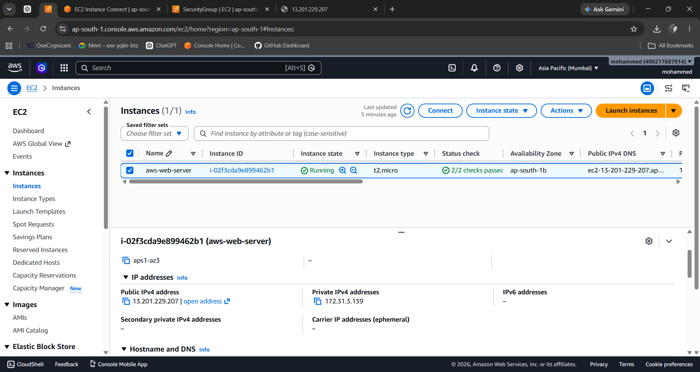
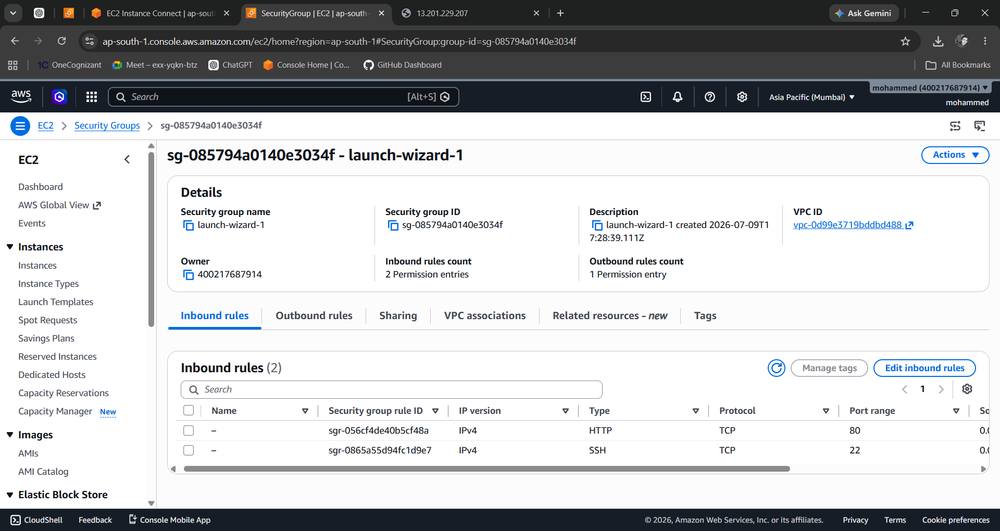
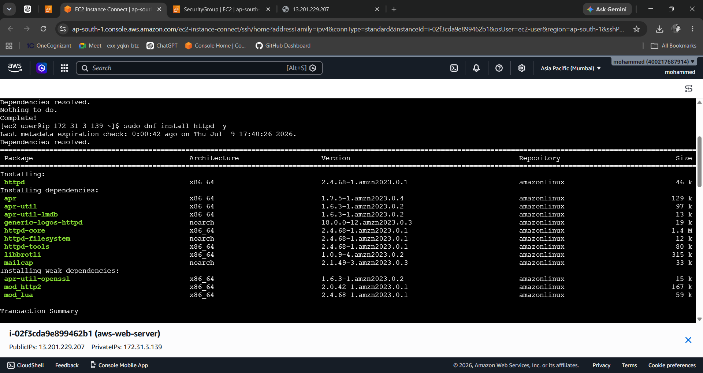
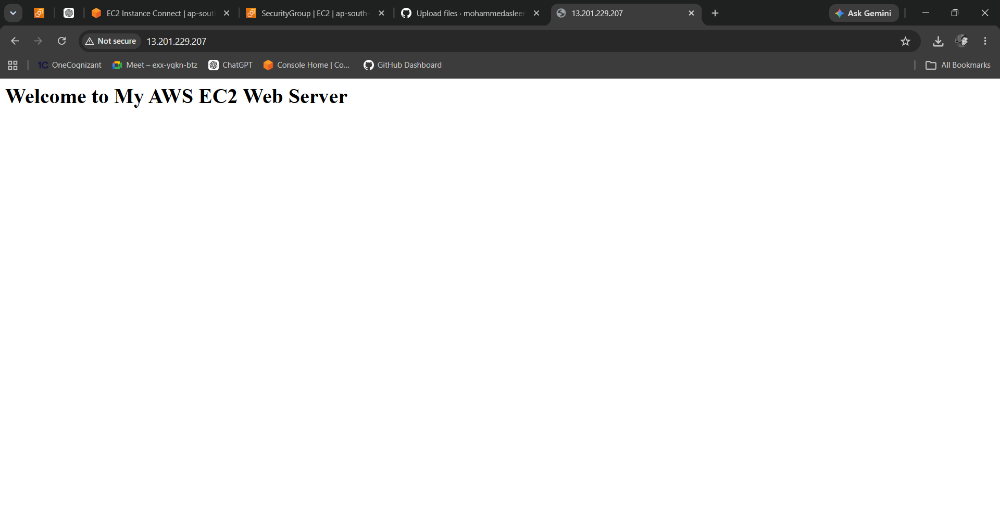

# AWS EC2 Web Server

## 📌 Project Overview

This project demonstrates how to launch an Amazon EC2 instance, configure AWS Security Groups, install the Apache HTTP Server, and deploy a simple static website using Amazon Linux 2023.

The project showcases fundamental AWS cloud skills required for entry-level Cloud Engineer and AWS Support roles.

---

## 🏗️ Architecture

```
Internet
    │
    ▼
AWS Security Group
(SSH 22 & HTTP 80)
    │
    ▼
Amazon EC2 Instance
(Amazon Linux 2023)
    │
    ▼
Apache HTTP Server
    │
    ▼
Static Website
```

---

## ☁️ AWS Services Used

- Amazon EC2
- AWS Security Groups

---

## 🛠️ Technologies Used

- Amazon Linux 2023
- Apache HTTP Server (httpd)
- Linux Terminal
- Git & GitHub

---

## 🚀 Implementation Steps

### Step 1
Launched an **Amazon EC2 t2.micro** instance using **Amazon Linux 2023**.

### Step 2
Configured a Security Group with the following inbound rules:

- SSH (Port 22)
- HTTP (Port 80)

### Step 3
Connected to the EC2 instance using **EC2 Instance Connect**.

### Step 4
Updated the operating system.

```bash
sudo dnf update -y
```

### Step 5
Installed Apache HTTP Server.

```bash
sudo dnf install httpd -y
```

### Step 6
Started and enabled Apache.

```bash
sudo systemctl start httpd
sudo systemctl enable httpd
```

### Step 7
Created a simple web page.

```bash
echo "<h1>Welcome to My AWS EC2 Web Server</h1>" | sudo tee /var/www/html/index.html
```

### Step 8
Verified the website using the EC2 Public IPv4 Address.

---

## 📸 Project Screenshots

### EC2 Instance Running



---

### Security Group Rules



---

### Apache Installation



---

### Website Successfully Hosted



---

## 🎯 Skills Demonstrated

- Amazon EC2
- AWS Security Groups
- Linux Administration
- Apache Web Server
- Website Hosting
- Cloud Networking
- Basic Troubleshooting
- Git & GitHub Documentation

---

## 📚 Key Learnings

- Launching and managing EC2 instances
- Configuring Security Groups
- Installing and managing web servers
- Hosting websites on AWS
- Troubleshooting connectivity issues
- Documenting cloud projects professionally

---

## ✅ Outcome

Successfully deployed a static website on an Amazon EC2 instance using Apache HTTP Server and configured secure network access using AWS Security Groups.

This project strengthened my understanding of AWS infrastructure, Linux administration, and cloud-based web hosting.
